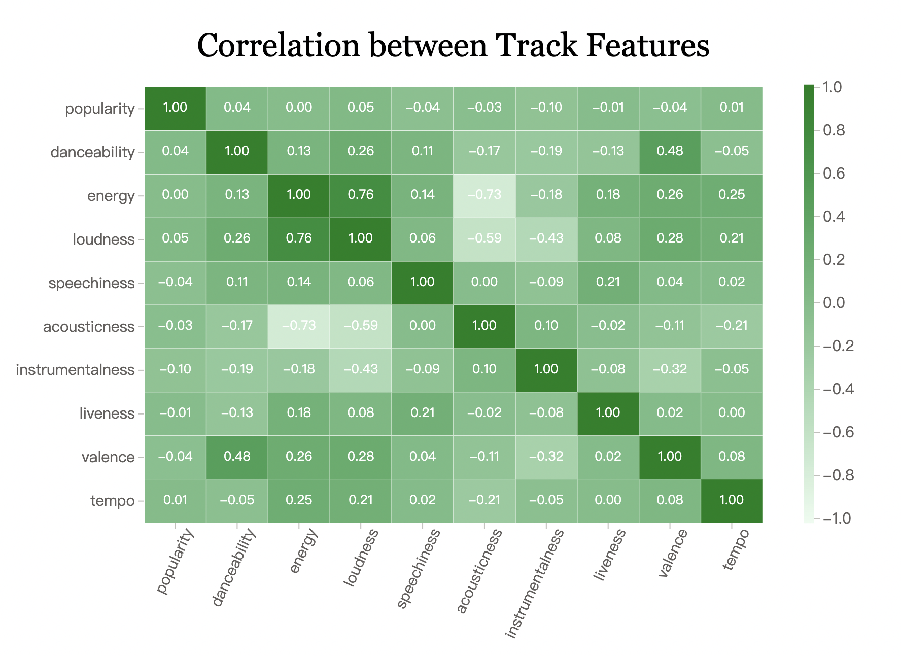
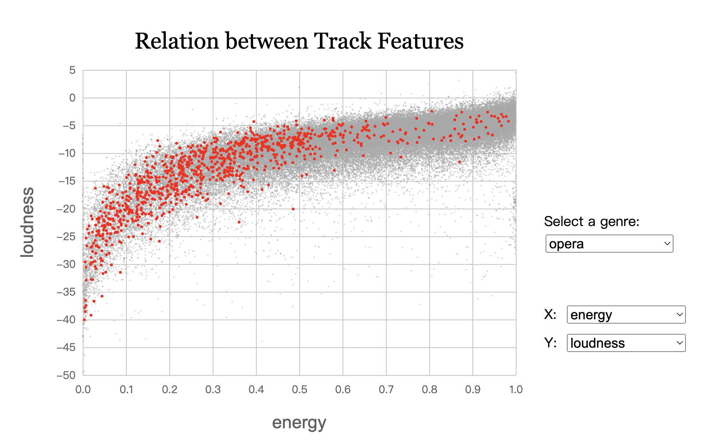
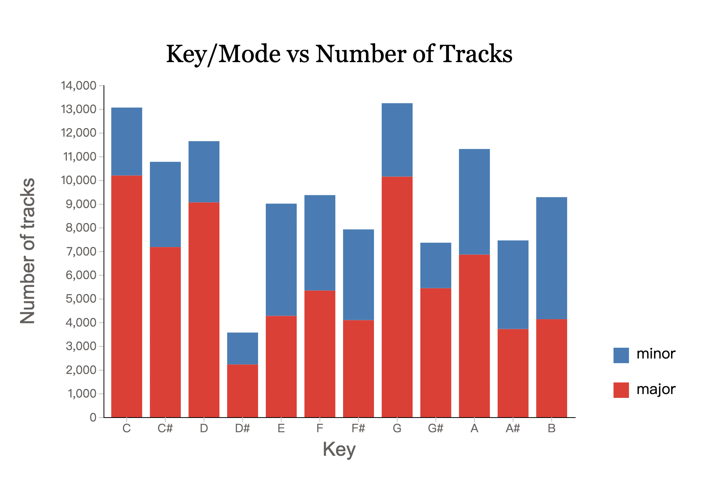
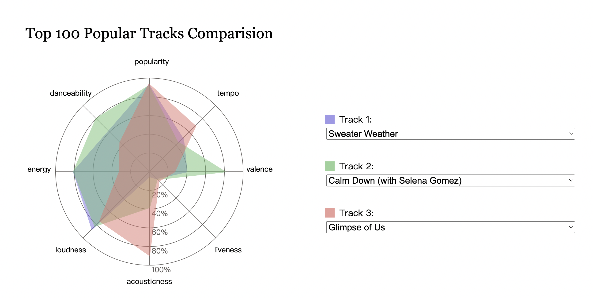

# Insight of Spotify Tracks Dataset

This is a web based tool which gives a simple insight into the Spotify Dataset.

The Dataset is downloaded from Kaggle: 
https://www.kaggle.com/datasets/maharshipandya/-spotify-tracks-dataset?resource=download

Data visualization is implemented by using D3.js.

## Charts
1. Heat map which shows the correlation coefficients of each pair of quantitative track features.

2. Scatter plot with an interactive interface, which presents the relation between each pair of quantitative track features selected. Users can also choose a certain genre to highlight on the chart.

3. Stacked bar chart which shows the number of tracks in each key and mode.

4. Radar chart with an interactive interface, which allows users to compare quantitative features of the 3 tracks selected among top 100 popular tracks.

